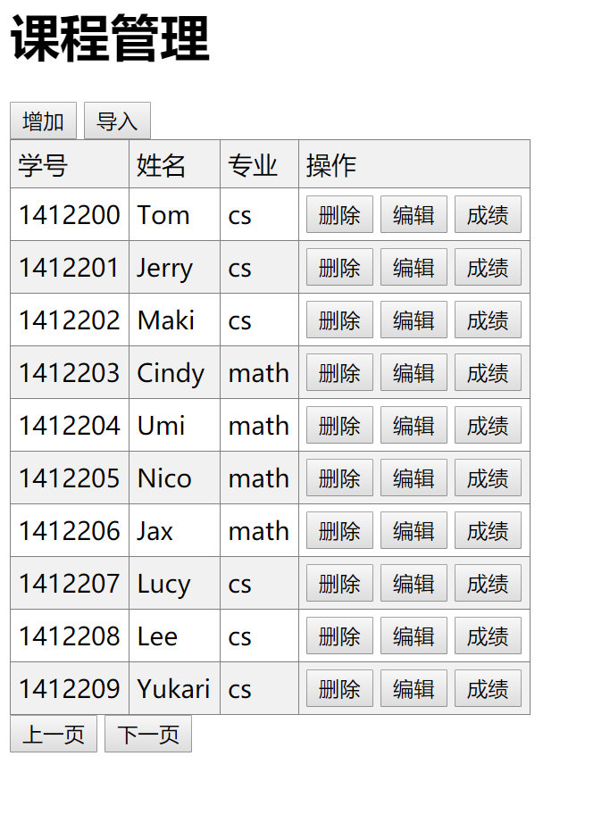

# sa-hw
#### Homework for NJU Course: Software Architecture
| author 141220029 冯伟赞

## 概述
这是一个软件体系结构课的课程管理系统，用到的架构有c/s架构，mvc，3-tiers等，后端使用[Spring-Boot](http://projects.spring.io/spring-boot/)框架编写，前端使用了AngularJs.

## 感受
第一次写前端的代码，Angularjs弄了好久, 老师多给点分吧(^-^)

## 运行

在运行前请先保证:   
1. 安装了mysql
2. 安装了maven
3. 有浏览器

请先更改本工程下的 SaBackend\src\main\resources\application.properties 的下面两项目
```html
spring.datasource.username=root
spring.datasource.password=root
```
把它们设为你的mysql用户名和密码   

另外进入mysql，执行下面命令:
```sql
mysql>CREATE DATABASE IF NOT EXISTS sa2017;
```
然后启动服务器
```cmd
cd SaBackend
mvn spring-boot:run
```
然后进入目录SaFrontend，点击index.xml用浏览器打开即可；



## Reference
1. [Building a RESTful Web Service](https://spring.io/guides)
2. [Accessing data with MySQL](https://spring.io/guides/gs/accessing-data-mysql/)
3. [Accessing Data with JPA](https://spring.io/guides/gs/accessing-data-jpa/)
4. [Spring Batch Tutorial: Reading Information From an Excel File](https://www.petrikainulainen.net/programming/spring-framework/spring-batch-tutorial-reading-information-from-an-excel-file/)
5. [AngularJS教程_w3cschool](https://www.w3cschool.cn/angularjs/)
6. [ng-dialog](https://www.npmjs.com/package/ng-dialog)